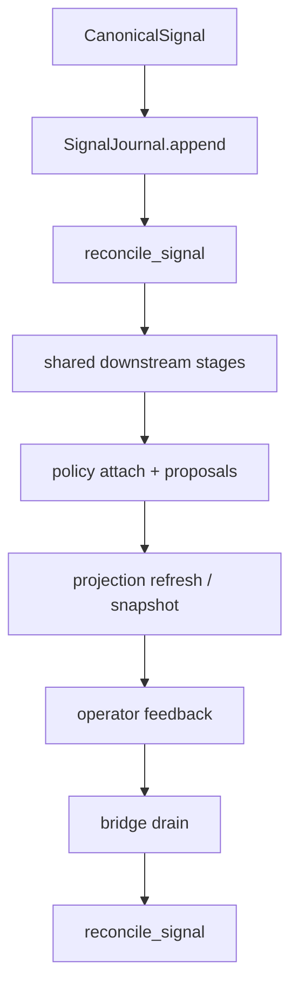

# RFC: D3 — `SIGNAL_RUNTIME_MODE=active` jako docelowy spine (i jak bezpiecznie przełączyć default)

| Pole              | Wartość                             |
| ----------------- | ----------------------------------- |
| **Data**          | 2026-06-02                          |
| **Status**        | implemented (CEL 2026-06-02, local) |
| **Autor**         | agent                               |
| **Luka (kernel)** | `gap:D3-dual-gmail-pollers`         |

---

## As-Is

W `gmail-agent` istnieją **dwa równoległe kręgosłupy** przetwarzania:

1. **Legacy**: `process_snapshot` uruchamia klasyczny „ogon legacy” dla wiadomości.
2. **Signal spine**: `reconcile_signal` + journal + (dla trybów `shadow|active`) downstream po sygnale.

W `SIGNAL_RUNTIME_MODE=active` ścieżka signal jest traktowana jako kręgosłup i kończy przebieg **wczesnym return**, co **pomija ogon legacy**. W `SIGNAL_RUNTIME_MODE=legacy` signal spine nie jest kręgosłupem (a system działa przewidywalnie w domyślnym Gate B lokalnie).

Ważny detal architektoniczny: intake LLM (`run_intake_reasoning`) jest historycznie „przed forkiem” i nie jest jednoznacznie częścią wspólnego downstream runnera dla reconcile. To powoduje, że `active` nie jest dziś bezpiecznym „najbardziej kompletnym” defaultem bez dodatkowych gwarancji.

- Truth flow: `gmail-agent/docs/core/truth_flow.md` (spine legacy vs signal + early return + open question)
- Control plane: `knowledge/CONTROL_PLANE.md` (local-primary; overlay runtime)
- Operator decyzja: `knowledge/memory/OPERATOR_DECISIONS.md` → local-only Docker; Local Gate B default = legacy

### Code pointers (konkretne pliki/symbole)

Te wskaźniki są po to, żeby lista zadań poniżej była „grep-proof” i nie opierała się na pamięci:

- **Default ustawienia**: `gmail-agent/tools/gmail_audit/config.py`
  - `DEFAULT_SIGNAL_RUNTIME_MODE = "legacy"`
  - walidacja: `SIGNAL_RUNTIME_MODE must be one of: legacy, shadow, active.`
- **Fork legacy vs signal**: `gmail-agent/tools/gmail_audit/gmail_intake.py`
  - `process_snapshot(...)` czyta `settings.signal_runtime_mode`
  - gdy `signal_runtime_mode in {"shadow","active"}` woła `gmail_signal_adapter.run_gmail_signal_runtime(...)`
  - gdy `signal_runtime_mode == "active"` i jest `reconcile_result`: zapisuje stage record i robi **return True** (to jest „active early return”, który omija ogon legacy)
  - „ogon legacy” zaczyna się dopiero po tym return i uruchamia `run_shared_downstream_stages(...)`
- **Signal reconcile**: `gmail-agent/tools/gmail_audit/signal_reconciler.py`
  - `reconcile_signal(...)` → `_reconcile_gmail_signal(...)` dla `source_kind=="gmail"`
- **Wspólny downstream (shared spine)**: `gmail-agent/tools/gmail_audit/intake_shared_downstream.py`
  - `run_shared_downstream_stages(...)` importuje i wywołuje etapy z `gmail_intake` (link/mailbox/business/CI/policy/finalize)
- **Testy dokumentujące różnice** (kanoniczne jako „source of truth” dla spine gap):
  - `gmail-agent/tools/gmail_audit/tests/test_process_snapshot_runtime_spine.py`
    - `test_active_mode_early_return_skips_legacy_tail`
    - `test_reconcile_gmail_signal_does_not_call_run_intake_reasoning`

---

## To-Be

Docelowo system ma jeden „production spine” oparty o sygnały:

- CanonicalSignal → journal → `reconcile_signal` → wspólny downstream (intake/BR/guidance/policy/projection) → operator feedback → reconcile → refresh projection

**Kluczowy warunek:** `SIGNAL_RUNTIME_MODE=active` jako default nie może tworzyć „drugiego świata” semantycznego — musi być parity z legacy dla krytycznych etapów i artefaktów.

---

## Warianty

| ID  | Opis                                                                        | Koszt  | ROI             | Ryzyko                                                            | Rekomendacja  |
| --- | --------------------------------------------------------------------------- | ------ | --------------- | ----------------------------------------------------------------- | ------------- |
| A   | Zostawić legacy jako default na stałe; signal tylko jako opcjonalny runtime | niski  | średni          | duży: dwie orkiestracje utrzymują się wiecznie                    | backup        |
| B   | `active` jako docelowy default, ale dopiero po domknięciu parity i D3       | średni | wysoki          | średni: wymaga dyscypliny testów                                  | **preferred** |
| C   | Szybko przełączyć default na `active` bez parity gate                       | niski  | pozornie wysoki | **bardzo duży**: silent drift, pominięte etapy przez early return | rejected      |

---

## Definition of Done: kiedy wolno ustawić `SIGNAL_RUNTIME_MODE=active` jako default

Poniższe punkty są „gate’ami” — jeśli którykolwiek nie jest spełniony, default zostaje `legacy`.

### DoD-1: Jedna semantyka krytycznych etapów (no legacy-only core)

- **Wymóg:** wszystkie etapy uznane za „core decision spine” mają uruchomienie w ścieżce signal (`reconcile_signal` + wspólny runner) lub mają jawnie zdefiniowany odpowiednik w signal.
- **Minimalny core** (aktualny Local Gate B): `intake_reasoning`, `business_reasoning`, `case_guidance`, `policy attach + proposals`, projection refresh.
- **Intake LLM:** `run_intake_reasoning` nie może pozostać „legacy-only” jeśli `active` ma być „najbardziej kompletnym” defaultem. Dopuszczalne jest jako _optional stage_ (gated), ale musi istnieć spójna ścieżka, w której signal spine osiąga ten sam rdzeń decyzji.

### DoD-2: Telemetria / artefakty per-stage dla active

- **Wymóg:** aktywna ścieżka zapisuje artefakty/stage records w sposób audytowalny i porównywalny do legacy.
- **Known gap do domknięcia:** gdy `signal_extraction` jest wołany inline, musi mieć spójny zapis (albo jawny, testowany powód braku).

### DoD-3: D3 zamknięte — jeden ingress/poller dla tej samej skrzynki

- **Wymóg:** brak „dual poller” lub twarde blokady/dedupe gwarantujące: jedna wiadomość → jeden CanonicalSignal → jedno reconcile (idempotent).

### DoD-4: Parity tests (legacy vs active) + testy early-return

- **Wymóg:** testy ochronne wykrywają, że `active` nie pomija wymaganych etapów przez early return i że wyniki/artefakty są spójne dla krytycznego rdzenia.

### DoD-5: Worker loop i narzędzia naprawcze są „first-class”

- **Wymóg:** worker loop jest primary entrypoint dla active, a replay/rebuild-case działają w tej samej semantyce.

---

## Lista zadań w kodzie (konkretne prace inżynieryjne)

Poniższe zadania opisują co trzeba zrobić w kodzie, żeby spełnić DoD powyżej. To jest lista „engineering tasks”, nie plan wdrożenia.

### Task A — przenieść intake LLM do spine (lub dodać ekwiwalent dla signal)

- Zidentyfikować, gdzie `run_intake_reasoning` jest wywoływany w legacy (dziś: `gmail-agent/tools/gmail_audit/gmail_intake.py` oraz potwierdzone w `test_process_snapshot_runtime_spine.py`).
- Zaprojektować i wdrożyć jedną z opcji:
  - **A1 (preferred):** intake stage jako element wspólnego downstream runnera wykorzystywanego przez legacy i reconcile (gated flagą).
  - **A2:** ekwiwalent intake stage wywoływany z reconcile przed/obok shared downstream, ale generujący te same kontrakty/artefakty.
- Dodać testy, że stage jest uruchamiany (gdy enabled) w trybie `active`.

**Konkretny punkt zaczepienia:** dziś test `ReconcileSpineGapTests.test_reconcile_gmail_signal_does_not_call_run_intake_reasoning` pokazuje, że `_reconcile_gmail_signal(...)` nie wchodzi w intake LLM — to jest dokładnie gap do domknięcia w tej task.

### Task B — domknąć telemetrię/stage records dla ścieżek inline

- Zlokalizować „inline calls” (np. `signal_extraction` w intake) i zapewnić, że zapisują:
  - `parse_status` / `error_reason` (jeśli dotyczy),
  - deterministyczny stage_name,
  - minimalny ślad w artefaktach runa.
- Dodać test regresji, że w `active` stage records zawierają expected wpisy dla core stage’ów.

### Task C — zamknąć D3: dual poller / multi-ingress

- Spisać wszystkie entrypointy, które mogą generować CanonicalSignal/pracę na tej samej skrzynce (CLI, worker loop, oneshot).
- Wprowadzić jedną strategię:
  - **C1:** single ingress (arch uproszczenie) lub
  - **C2:** twarda idempotencja + lock/dedupe + jednoznaczny „owner” pollera.
- Testy: idempotency (powtórny sygnał nie tworzy drugiej pracy ani nie duplikuje side-effectów).

**Konkretny punkt zaczepienia:** `gmail_intake.process_snapshot(...)` potrafi uruchomić zarówno `run_intake_reasoning` jak i `run_gmail_signal_runtime(...)` (dla `shadow|active`). Jeśli dojdzie do równoległych ingressów (np. worker + CLI), bez dedupe/lock powstaną duble. Kryterium D3 jest „jeden owner pollera”.

### Task D — parity tests: legacy vs active

- Dodać testy porównawcze, które na tym samym input:
  - uruchamiają `legacy` i `active`,
  - porównują „core outcomes” (kontrakty Pydantic, kluczowe metadane, artefakty stage’ów),
  - wykrywają pominięte etapy przy early return.
- Dodać testy, że `active` robi wszystkie wymagane etapy nawet jeśli kończy wcześniej niż legacy.

### Task E — worker loop jako primary + narzędzia naprawcze

- Upewnić się, że `signal-worker` loop jest stabilny i testowany jako primary path.
- Upewnić się, że `signal-replay` i `signal-rebuild-case` są:
  - kompatybilne z active semantics,
  - weryfikowane testami (i mają czytelne artefakty).

**Konkretny punkt zaczepienia:** runtime spine i config są już testowane w `tools/gmail_audit/tests/test_signal_runtime_settings.py` oraz w PR-2 testach spine; ta task ma podnieść worker/replay/rebuild do poziomu „głównej ścieżki”, nie tylko narzędzi pomocniczych.

---

## Wpływ

| Obszar                              | Dotknięte?                                  |
| ----------------------------------- | ------------------------------------------- |
| Repozytoria                         | gmail-agent                                 |
| Gate A / Gate B / LAST_PROVEN_STATE | tak (zmiana defaultu wymaga nowych proofów) |
| Operator UX (Daszek)                | pośrednio (projection refresh + parity)     |
| D3 (dual poller)                    | tak (arch boundary)                         |

---

## Ryzyka regresji

- Silent drift: `active` pomija core etapy, ale testy tego nie łapią.
- Podwójne ingressy: active + legacy równolegle tworzą duble lub race.
- Telemetria: brak audytu per-stage utrudnia diagnostykę i proof.

---

## Akceptacja operatora

- [ ] Zaakceptowano wariant: B (docelowo `active`, po domknięciu DoD)
- Data: \_\_\_
- Uwagi: \_\_\_

---

## Po implementacji (checklist)

- [ ] Testy parity (legacy vs active) zielone
- [ ] D3 zamknięte (single ingress / idempotency)
- [ ] Telemetria per-stage spójna dla active
- [ ] Wpis w `knowledge/CONTROL_PLANE.md` (default może przejść na active)
- [ ] Aktualizacja `gmail-agent/docs/core/truth_flow.md` (overlay runtime + decyzja)
