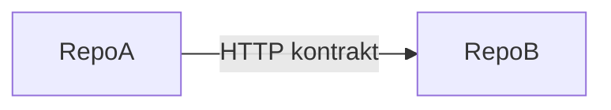

# RFC: [Krótki tytuł integracji / epiku]

| Pole              | Wartość                                                     |
| ----------------- | ----------------------------------------------------------- |
| **Data**          | YYYY-MM-DD                                                  |
| **Status**        | draft \| accepted \| rejected                               |
| **Autor**         | agent / operator                                            |
| **Luka (kernel)** | np. `gap:D2-gmail-to-kalk`, `gap:P0-case-workflow-identity` |

---

## As-Is

1–2 akapity: co jest dziś podłączone / niepodłączone.

- Atlas: [`SYSTEM_ATLAS.md`](../SYSTEM_ATLAS.md) — sekcja …
- Kernel: [`TOPINSTAL-KERNEL-GRAPH.yaml`](../TOPINSTAL-KERNEL-GRAPH.yaml) — `gap:…`
- Boundaries: [`EVOLUTION_BOUNDARIES.md`](../EVOLUTION_BOUNDARIES.md) — warianty …

---

## To-Be

Opis docelowego przepływu (lista krawędzi lub diagram mermaid).

---

## Warianty

| ID  | Opis | Koszt | ROI | Ryzyko | Rekomendacja           |
| --- | ---- | ----- | --- | ------ | ---------------------- |
| A   |      |       |     |        |                        |
| B   |      |       |     |        | **preferred** / backup |

---

## Kontrakt (jeśli dotyczy)

| Element          | Wartość               |
| ---------------- | --------------------- |
| Metoda / ścieżka | `POST …` / `GET …`    |
| Producer         | repo                  |
| Consumer         | repo                  |
| Env              | `*_BASE_URL`, tokeny  |
| Timeout / retry  |                       |
| Idempotency      | klucz                 |
| Failure mode     | degrade / fail-closed |

---

## Wpływ

| Obszar                              | Dotknięte? |
| ----------------------------------- | ---------- |
| Repozytoria                         |            |
| `contracts.json` / `group.yaml`     |            |
| `OfferDTO` / `CalcRequestDTO`       |            |
| Gate A / Gate B / LAST_PROVEN_STATE |            |
| Operator UX (Daszek)                |            |

---

## Ryzyka regresji

- …

---

## Akceptacja operatora

- [ ] Zaakceptowano wariant: \_\_\_
- Data: \_\_\_
- Uwagi: \_\_\_

---

## Po implementacji (checklist)

- [ ] Kod w repo (Execution po akceptacji)
- [ ] Wpis w [`TOPINSTAL-KERNEL-GRAPH.yaml`](../TOPINSTAL-KERNEL-GRAPH.yaml) (nowa krawędź lub zamknięcie luki)
- [ ] Wpis w `gitnexus/topinstal-workspace/group.yaml` jeśli nowy REST
- [ ] `gitnexus group sync topinstal-workspace --verbose`
- [ ] Aktualizacja [`SYSTEM_ATLAS.md`](../SYSTEM_ATLAS.md) As-Is jeśli zmienił się runtime
- [ ] Testy / proof pack jeśli dotyczy produkcji
